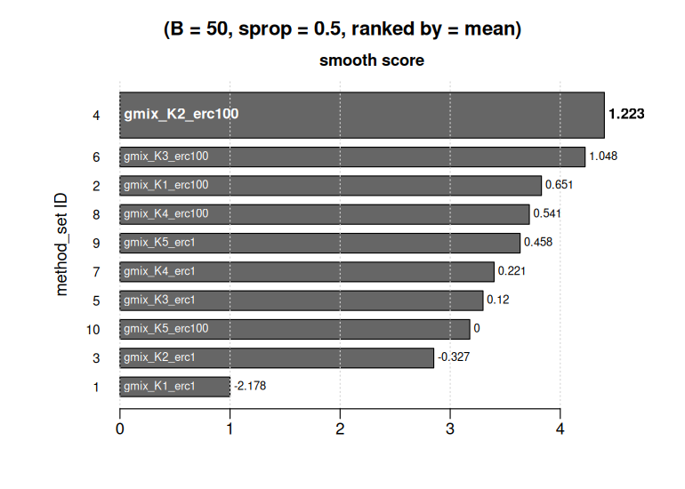
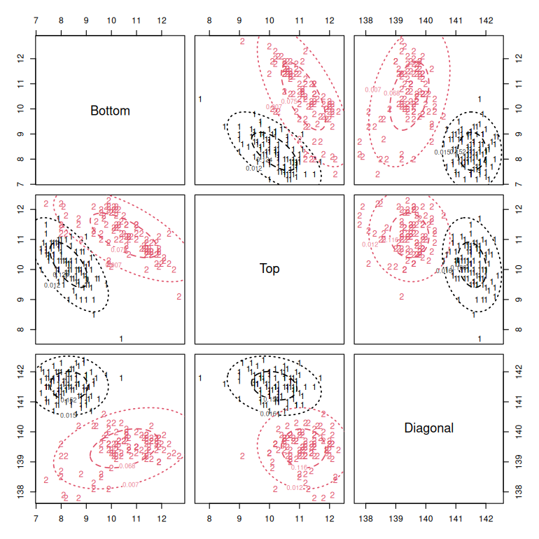
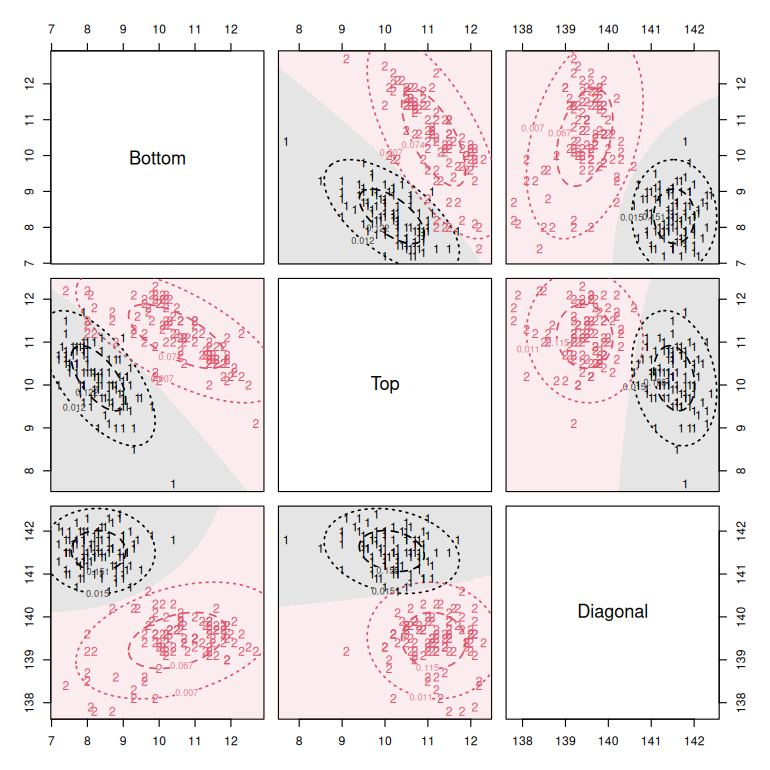

<!-- Updated: 03-09-2026 | Author: Pietro Coretto and Luca Coraggio -->

# QCLUSTER: CLUSTERING SELECTION BY HELD-OUT QUADRATIC SCORING

We demonstrate the use of the [`qcluster`](https://CRAN.R-project.org/package=qcluster) R package of

- Luca Coraggio — [luca-coraggio.com](https://luca-coraggio.com) · [GitHub](https://github.com/LucaCoraggio)

- Pietro Coretto — [pietro-coretto.github.io](https://pietro-coretto.github.io) · [GitHub](https://github.com/pietro-coretto)

The document has two parts:

- **Part I**: basic use of the package.

- **Part II**: for the reader who wants to control the details of the methodology.

Everything below runs on the `banknote` data that ship with the package, so the document is self-contained. The only external dependency is `mclust`, which one section of Part II uses to demonstrate how the user brings a method the package does not provide into a comparison.


``` r
library(qcluster)
```

```
## 
## QCLUSTER: tuning clustering methods and cluster validation via resampling 
## Type 'citation("qcluster")' for citing this R package in publications.
```

``` r
## The number of parallel workers is deliberately small: we do not know
## what machine this runs on. Raise it on your own. The result does not
## depend on it, because every (method, split) task draws its own
## random-number substream, so a run is reproducible under set.seed()
## whatever the number of cores.
NCORES <- 2L
```

## The data

Six measurements on two hundred old Swiss 1000-franc banknotes, one hundred genuine and one hundred counterfeit.
We keep the class label aside: no procedure below ever sees it, and we read it only at the very end to look at what the selection found.


``` r
data("banknote")

dat <- banknote[-1]     ## the six features
cl0 <- banknote$Class   ## reference classes, held out of the analysis

table(cl0)
```

```
## cl0
## counterfeit     genuine 
##         100         100
```

---

# PART I — THE SHORT RECIPE

The entry point is `qcluster()`. It takes the data and a *method set*, an object listing the candidates to compare, and returns them scored and ranked.

## Set the list of candidates for the selection

`mset_gmix()` builds a method set of Gaussian mixture models. Here we have five numbers of groups crossed with two settings of the eigenvalue ratio constraint, so ten candidates in all. The constraint, `erc`, is the largest ratio allowed between eigenvalues of the fitted cluster scatter matrices. This constraint is a model hyper-parameter that regularizes the MLE and affects the geometry of the final clusters.
At `erc = 1` the constraint forces the clusters to be spherical and identical in size; at `erc = 100` they may differ considerably in volume and elongation. It is a complexity knob, and it is exactly the kind of tuning that a selection criterion should settle.


``` r
M0 <- mset_gmix(K = 1:5, erc = c(1, 100))

M0
```

```
##  id method_name    fname settings    
##   1 gmix_K1_erc1   gmix  K=1, erc=1  
##   2 gmix_K1_erc100 gmix  K=1, erc=100
##   3 gmix_K2_erc1   gmix  K=2, erc=1  
##   4 gmix_K2_erc100 gmix  K=2, erc=100
##   5 gmix_K3_erc1   gmix  K=3, erc=1  
##   6 gmix_K3_erc100 gmix  K=3, erc=100
##   7 gmix_K4_erc1   gmix  K=4, erc=1  
##   8 gmix_K4_erc100 gmix  K=4, erc=100
##   9 gmix_K5_erc1   gmix  K=5, erc=1  
##  10 gmix_K5_erc100 gmix  K=5, erc=100
```

## Validation


``` r
set.seed(20260903)

val0 <- qcluster(dat, M0, B = 50, ncores = NCORES)
```

`B` is the number of splits. Everything else stays at its default: the smooth score, a training fraction of one half, and the ranking that maximizes the held-out mean.


## Reading the table


``` r
val0
```

```
## Top by smooth score (B=50, sprop=0.5, rankby='mean', prob=0.05, max_na_prop=0.05):
## ----------------------------------------------------------------------------------
## 
##                id rank       mean   sterr    lower    upper complexity crank na_prop
## gmix_K2_erc100  4    1  1.2228776 0.21632  0.80560  1.46395    0.80318     7       0
## gmix_K3_erc100  6    2  1.0478926 0.33988  0.45061  1.43838    1.48039     8       0
## gmix_K1_erc100  2    3  0.6513057 0.17144  0.34939  0.86687    0.36500     3       0
## gmix_K4_erc100  8    4  0.5412139 0.49163 -0.10310  0.95927    2.16608     9       0
## gmix_K5_erc1    9    5  0.4575849 0.32466 -0.09245  0.88822    0.70243     6       0
## gmix_K4_erc1    7    6  0.2214517 0.20426 -0.06999  0.47399    0.59491     5       0
## gmix_K3_erc1    5    7  0.1204820 0.23251 -0.26431  0.40101    0.45287     4       0
## gmix_K5_erc100 10    8  0.0003493 0.56905 -0.78120  0.63225    2.94825    10       0
## gmix_K2_erc1    3    9 -0.3270997 0.21265 -0.76948 -0.06315    0.24168     2       0
## gmix_K1_erc1    1   10 -2.1777245 0.09215 -2.31632 -2.04660    0.08463     1       0
## 
## 
## 
## Available components:
##  smooth B sprop prob data method_set max_na_prop rankby delta best_smooth origin raw
```

One row per candidate, in rank order.

- `mean` is the criterion, the average held-out score.
- `sterr` describes how much that average moves when the training observations change; it is not the standard error of a mean over `B` and it is not a confidence half-width, so read it across candidates rather than on its own.
- `lower` and `upper` are the lower and the upper percentile bound of the split distribution.
- `complexity` is the gap between the score a candidate gives itself on its own training block and the score it earns on the held-out block, that is how much it flatters itself; `crank` orders the candidates by complexity, `1` being the simplest.
- `na_prop` is the fraction of splits on which the candidate failed to produce a usable fit.

## The picture


``` r
plot(val0)
```



## Selecting and fitting

The scored object holds no fitted models. `qcluster_select()` takes the rank-one candidate and re-estimates it on the whole data set.


``` r
fit0 <- qcluster_select(val0)
```

```
## smooth score... found 1 rank-1 solution(s).
```

```
## 	...estimating solution: gmix_K2_erc100 (method_set id = 4)
```

``` r
fit0
```

```
## 
## === METHOD INFO ===
## Method 4: gmix_K2_erc100
## fullname: gmix:K=2|init=kmed|erc=100|iter_max=1000|tol=1e-08|init_nstart=25|init_iter_max=30|init_tol=1e-08
## callargs:
##   K = 2L
##   init = "kmed"
##   erc = 100
##   iter_max = 1000
##   tol = 1e-08
##   init_nstart = 25
##   init_iter_max = 30
##   init_tol = 1e-08
## 
## 
## === AVAILABLE COMPONENTS ===
## info_apply_method info iter N P K loglik size cluster posterior params
```

## Looking at the solution

The returned object is the native fit of whatever method won, so the usual methods apply to it.


``` r
plot(fit0, data = dat, subset = c(4, 5, 6),
     what = c("clustering", "contour"))
```



And now, only now, the labels that we kept aside:


``` r
table(cl0, fit0$cluster)
```

```
##              
## cl0             1   2
##   counterfeit   0 100
##   genuine      99   1
```

## What comes next

That is the whole of the basic use. The point of the approach is that the comparison need not be homogeneous at all. Part II builds candidate lists from sequences of tuning values across several families at once, brings in two methods the package does not implement, reduces the resulting list before spending computing time on it, and then goes through the three ranking rules and the selection interface one at a time.

---

# PART II — CONTROLLING THE DETAILS

A warning on running time before anything else. Part II compares of the order of a hundred and fifty candidates, twice: once cheaply, to discard the hopeless ones, and once properly on what survives. On a modest machine this is minutes rather than seconds.
Shorten `KK` below if you only want to see the mechanics.


## What the score can and cannot rank

The quadratic score is not a general-purpose cluster validation index, and treating it as one is the one way to misuse it. It scores a clustering through the quadratic discriminant function evaluated at the cluster description: proportions, centers, and covariance matrices. The groups it can recognize and rank are therefore groups that quadratic boundaries separate well (linear boundaries being the special case in which the scatters agree). This is a real class, and a broad one: it covers elliptical groups of different volume, shape and orientation that various methods can discover (model-based clustering based on elliptical models, k-means and other partitioning methods based on an appropriate dissimilarity notion). It does not cover groups defined by connectivity or by any notion under which a cluster is not a location-and-scatter object: a ring around a blob is two clusters to a density-based method and one badly fitted ellipse to this score.

The practical consequence for the rest of this section is a rule about which methods it is legitimate to put into a comparison. The user can wrap any clustering method and pass it to `qcluster()`, and `qcluster()` scores it without complaint. Whether the resulting number means anything depends on whether the method pursues a notion of cluster compatible with the one the score encodes. Comparing a Gaussian mixture, a k-means partition and a Ward dendrogram cut is legitimate, because all three can discover similar kinds of objects. In what follows we give a couple of examples.


## Candidate families from sequences with package pre-built constructors 

The `mset_*` constructors expand every argument they are given into a grid: one candidate per combination of values. This is what makes it cheap to state a comparison as a set of sequences rather than as a list of models.


``` r
## number of clusters from 1 to 10
KK <- 1:10

## GAUSSIAN MIXTURES: 10 values of K, 3 ERC constraint levels
GMIX <- mset_gmix(K = KK, erc = c(1, 100, 1000))

## STUDENT-T MIXTURES, 10 values of K, 3 ERC constraint levels, 2 fixed
## degrees of freedom
TMIX <- mset_tmix(K = KK, erc = c(1, 100, 1000), df = c(4, 15))

## KMEANS: a partitioning method, it estimates no scatter, and yet it is scorable
## The closures generated by the constructor generates cluster description from the
## returned partition, through clust2params()
KMNS <- mset_kmeans(K = KK)
```


## Set methods that the package does not provide

The user can work with any method of choice using the constructor `mset_user()`. This is the general constructor of which all the others are specializations. It takes the *name* of a prototype function and expands the arguments passed through `...` into one candidate per combination, exactly as above. The prototype must take `data` as its first argument and must return a list carrying a `params` component with `proportion` (length K), `mean` (P by K), and `cov` (P by P by K). 

The construction requires two things:

- a function wrapper so that, for a fixed candidate,  the method is able to output a cluster description with a list containing:  `proportion` , `mean`,  `cov`, and cluster labels. The function wrapper can take any input and output, the only requirement is the previous cluster description; 

- the construction of the list of candidates via `mset_user()`.

We explore two cases:

- a case where the method/algorithm does not _naturally_ provide the cluster parametric description;
- a case where the method/algorithm already provides the description.


### CASE 1: the method that returns labels only

Hierarchical clustering returns a tree; cutting it returns labels and nothing else. `clust2params()` supplies the rest. One can question whether this method can produce adequate "quadratic partitions", however here we wanto to only show the flexibility of the following constructor. 

The following function wrapper provides the cluster description via its output object `res`. The parametric description is filled using `clust2params()`. The follosing call to `mset_user()` constructs the list of candidates. In this case we want to validate over number of clusters and linkage, for which we consider `method = c("ward.D2", "complete")`.  An important argument  here is `method_name`, it creates a meaninful codename by which a candidate is addressed and printed in the outputs. In absence of specified `method_name`,  `mset_user()` will guess one.  `.export` names the objects needed by the parallel workers in parallel executions.


``` r
## method's wrapper 
hc_wrapper <- function(data, K, ...) {
    ## Description
    ##     Prototype wrapper exposing stats::hclust() to mset_user(), by
    ##     cutting the tree at K groups and attaching the cluster
    ##     description the score consumes.
    ##
    ## Syntax
    ##     hc_wrapper(data, K, ...)
    ##
    ## Arguments
    ##     data  numeric matrix or data frame of observations
    ##     K     number of groups at which the tree is cut
    ##     ...   further arguments passed to hclust(), typically the
    ##           agglomeration 'method'
    ##
    ## Example
    ##     hc_wrapper(banknote[-1], K = 2, method = "ward.D2")
    ##
    dm <- dist(data, method = "euclidean")
    hc <- hclust(dm, ...)
    cl <- cutree(hc, k = K)

    res         <- list()
    res$cluster <- cl
    res$params  <- clust2params(data, cluster = cl)
    return(res)
}

## construnction of the candidates' list 
HCL <- mset_user(fname = "hc_wrapper",
                 K = KK,
                 method = c("ward.D2", "complete"),
                 method_name = function(K, method) {
                     paste0("hc_", method, "_K", K)
                 },
                 .export = "hc_wrapper")

length(HCL)
```

```
## [1] 20
```


### CASE 2: a method that already carries the description (size, mean, cov)

`mclust` fits Gaussian mixtures, so the parameters are in the fitted object already and only need to be renamed into the layout the score expects. In this case we want to validate mclust models with varying `K` and covariance models "EEI", "VVI", and "VVV". The wrapping function only needs to translate the mclust's output into the desired description object returned by the wrapper. The following constructor in this case needs an additional input: `.packages`.  The argument '.packages' is the mechanism for a prototype whose dependencies are not visible on a parallel worker, whose environment does not inherit the current one. Here it also has to *attach* mclust rather than merely load its namespace, because Mclust resolves some of its own internals by bare name.


``` r
library(mclust)
## function wrapper 
mc_wrapper <- function(data, K, ...) {
    ## Description
    ##     Prototype wrapper exposing mclust::Mclust() to mset_user(), by
    ##     relabelling the fitted parameters into the layout qcluster
    ##     expects.
    ##
    ## Syntax
    ##     mc_wrapper(data, K, ...)
    ##
    ## Arguments
    ##     data  numeric matrix or data frame of observations
    ##     K     number of mixture components
    ##     ...   further arguments passed to mclust::Mclust(), typically
    ##           'modelNames'
    ##
    ## Example
    ##     mc_wrapper(banknote[-1], K = 2, modelNames = "VVV")
    y <- mclust::Mclust(data, G = K, ...)

    y[["cluster"]] <- y[["classification"]]
    y[["params"]]  <- list(proportion = y$parameters$pro,
                           mean       = y$parameters$mean,
                           cov        = y$parameters$variance$sigma)
    return(y)
}

## construnction of the candidates' list 
MCL <- mset_user(fname = "mc_wrapper",
                 K = KK,
                 modelNames = c("EEI", "VVI", "VVV"),
                 method_name = function(K, modelNames) {
                     paste0("mcl_", modelNames, "_K", K)
                 },
                 .packages = "mclust",
                 .export = "mc_wrapper")

length(MCL)
```

```
## [1] 30
```


## Using the method list

A method set is a list of ready-to-run clustering setups, and it can be inspected and executed as such.


``` r
## the compact table: index, codename, base routine, and only the
## arguments that actually vary within each routine group
print(HCL)
```

```
##  id method_name     fname      settings             
##   1 hc_ward.D2_K1   hc_wrapper method=ward.D2, K=1  
##   2 hc_ward.D2_K2   hc_wrapper method=ward.D2, K=2  
##   3 hc_ward.D2_K3   hc_wrapper method=ward.D2, K=3  
##   4 hc_ward.D2_K4   hc_wrapper method=ward.D2, K=4  
##   5 hc_ward.D2_K5   hc_wrapper method=ward.D2, K=5  
##   6 hc_ward.D2_K6   hc_wrapper method=ward.D2, K=6  
##   7 hc_ward.D2_K7   hc_wrapper method=ward.D2, K=7  
##   8 hc_ward.D2_K8   hc_wrapper method=ward.D2, K=8  
##   9 hc_ward.D2_K9   hc_wrapper method=ward.D2, K=9  
##  10 hc_ward.D2_K10  hc_wrapper method=ward.D2, K=10 
##  11 hc_complete_K1  hc_wrapper method=complete, K=1 
##  12 hc_complete_K2  hc_wrapper method=complete, K=2 
##  13 hc_complete_K3  hc_wrapper method=complete, K=3 
##  14 hc_complete_K4  hc_wrapper method=complete, K=4 
##  15 hc_complete_K5  hc_wrapper method=complete, K=5 
##  16 hc_complete_K6  hc_wrapper method=complete, K=6 
##  17 hc_complete_K7  hc_wrapper method=complete, K=7 
##  18 hc_complete_K8  hc_wrapper method=complete, K=8 
##  19 hc_complete_K9  hc_wrapper method=complete, K=9 
##  20 hc_complete_K10 hc_wrapper method=complete, K=10
```

``` r
## the codenames are what every other function matches against
head(names(GMIX))
```

```
## [1] "gmix_K1_erc1"    "gmix_K1_erc100"  "gmix_K1_erc1000" "gmix_K2_erc1"    "gmix_K2_erc100"  "gmix_K2_erc1000"
```

``` r
## everything about one candidate, addressed by position or by codename
summary(GMIX, id = 1)
```

```
##  id method_name      fname settings      
##   1 gmix_K1_erc1     gmix  K=1, erc=1    
##   2 gmix_K1_erc100   gmix  K=1, erc=100  
##   3 gmix_K1_erc1000  gmix  K=1, erc=1000 
##   4 gmix_K2_erc1     gmix  K=2, erc=1    
##   5 gmix_K2_erc100   gmix  K=2, erc=100  
##   6 gmix_K2_erc1000  gmix  K=2, erc=1000 
##   7 gmix_K3_erc1     gmix  K=3, erc=1    
##   8 gmix_K3_erc100   gmix  K=3, erc=100  
##   9 gmix_K3_erc1000  gmix  K=3, erc=1000 
##  10 gmix_K4_erc1     gmix  K=4, erc=1    
##  11 gmix_K4_erc100   gmix  K=4, erc=100  
##  12 gmix_K4_erc1000  gmix  K=4, erc=1000 
##  13 gmix_K5_erc1     gmix  K=5, erc=1    
##  14 gmix_K5_erc100   gmix  K=5, erc=100  
##  15 gmix_K5_erc1000  gmix  K=5, erc=1000 
##  16 gmix_K6_erc1     gmix  K=6, erc=1    
##  17 gmix_K6_erc100   gmix  K=6, erc=100  
##  18 gmix_K6_erc1000  gmix  K=6, erc=1000 
##  19 gmix_K7_erc1     gmix  K=7, erc=1    
##  20 gmix_K7_erc100   gmix  K=7, erc=100  
##  21 gmix_K7_erc1000  gmix  K=7, erc=1000 
##  22 gmix_K8_erc1     gmix  K=8, erc=1    
##  23 gmix_K8_erc100   gmix  K=8, erc=100  
##  24 gmix_K8_erc1000  gmix  K=8, erc=1000 
##  25 gmix_K9_erc1     gmix  K=9, erc=1    
##  26 gmix_K9_erc100   gmix  K=9, erc=100  
##  27 gmix_K9_erc1000  gmix  K=9, erc=1000 
##  28 gmix_K10_erc1    gmix  K=10, erc=1   
##  29 gmix_K10_erc100  gmix  K=10, erc=100 
##  30 gmix_K10_erc1000 gmix  K=10, erc=1000
```

``` r
summary(GMIX, method_name = names(GMIX)[4])
```

```
##  id method_name      fname settings      
##   1 gmix_K1_erc1     gmix  K=1, erc=1    
##   2 gmix_K1_erc100   gmix  K=1, erc=100  
##   3 gmix_K1_erc1000  gmix  K=1, erc=1000 
##   4 gmix_K2_erc1     gmix  K=2, erc=1    
##   5 gmix_K2_erc100   gmix  K=2, erc=100  
##   6 gmix_K2_erc1000  gmix  K=2, erc=1000 
##   7 gmix_K3_erc1     gmix  K=3, erc=1    
##   8 gmix_K3_erc100   gmix  K=3, erc=100  
##   9 gmix_K3_erc1000  gmix  K=3, erc=1000 
##  10 gmix_K4_erc1     gmix  K=4, erc=1    
##  11 gmix_K4_erc100   gmix  K=4, erc=100  
##  12 gmix_K4_erc1000  gmix  K=4, erc=1000 
##  13 gmix_K5_erc1     gmix  K=5, erc=1    
##  14 gmix_K5_erc100   gmix  K=5, erc=100  
##  15 gmix_K5_erc1000  gmix  K=5, erc=1000 
##  16 gmix_K6_erc1     gmix  K=6, erc=1    
##  17 gmix_K6_erc100   gmix  K=6, erc=100  
##  18 gmix_K6_erc1000  gmix  K=6, erc=1000 
##  19 gmix_K7_erc1     gmix  K=7, erc=1    
##  20 gmix_K7_erc100   gmix  K=7, erc=100  
##  21 gmix_K7_erc1000  gmix  K=7, erc=1000 
##  22 gmix_K8_erc1     gmix  K=8, erc=1    
##  23 gmix_K8_erc100   gmix  K=8, erc=100  
##  24 gmix_K8_erc1000  gmix  K=8, erc=1000 
##  25 gmix_K9_erc1     gmix  K=9, erc=1    
##  26 gmix_K9_erc100   gmix  K=9, erc=100  
##  27 gmix_K9_erc1000  gmix  K=9, erc=1000 
##  28 gmix_K10_erc1    gmix  K=10, erc=1   
##  29 gmix_K10_erc100  gmix  K=10, erc=100 
##  30 gmix_K10_erc1000 gmix  K=10, erc=1000
```
Each element carries the closure that runs it, so a candidate can be fitted directly, and asked for the cluster description alone.


``` r
mm <- MCL[["mcl_VVV_K3"]]
mm
```

```
## $fullname
## [1] "mc_wrapper:modelNames=VVV|K=3"
## 
## $callargs
## $callargs$modelNames
## [1] "VVV"
## 
## $callargs$K
## [1] 3
## 
## 
## $fn
## function (data, only_params = FALSE, only_labels = FALSE) 
## {
##     res <- do.call(function (data, K, ...) 
##     {
##         y <- mclust::Mclust(data, G = K, ...)
##         y[["cluster"]] <- y[["classification"]]
##         y[["params"]] <- list(proportion = y$parameters$pro, 
##             mean = y$parameters$mean, cov = y$parameters$variance$sigma)
##         return(y)
##     }, c(list(data), list(modelNames = "VVV", K = 3L)))
##     if (only_labels) {
##         if (is.null(res$cluster)) {
##             .stop_hint("the user method does not surface a 'cluster' label vector", 
##                 "have 'fname' return a 'cluster' element of integer labels to use only_labels")
##         }
##         return(res$cluster)
##     }
##     if (only_params) {
##         return(res$params)
##     }
##     else {
##         return(res)
##     }
## }
## <environment: 0x60085c1121b8>
## 
## $.packages
## [1] "mclust"
## 
## $.export
## [1] "mc_wrapper"
```

``` r
fit_mc <- mm$fn(dat)
class(fit_mc)
```

```
## [1] "Mclust"
```

``` r
## only the cluster description, which is the form the scoring engine uses
str(mm$fn(dat, only_params = TRUE))
```

```
## List of 3
##  $ proportion: num [1:3] 0.0907 0.4892 0.4201
##  $ mean      : num [1:6, 1:3] 215.02 130.5 130.31 8.78 11.16 ...
##   ..- attr(*, "dimnames")=List of 2
##   .. ..$ : chr [1:6] "Length" "Left" "Right" "Bottom" ...
##   .. ..$ : NULL
##  $ cov       : num [1:6, 1:6, 1:3] 0.2766 -0.0139 -0.037 0.0948 -0.0943 ...
##   ..- attr(*, "dimnames")=List of 3
##   .. ..$ : chr [1:6] "Length" "Left" "Right" "Bottom" ...
##   .. ..$ : chr [1:6] "Length" "Left" "Right" "Bottom" ...
##   .. ..$ : NULL
```

However, `apply_method()` does the same through the set rather than through the element, and returns the fit with a rendered description of the method attached, so that it can say later what it is. Here we easily put together 150 candidates.


``` r
fit_hc <- apply_method(dat, HCL, method_name = "hc_ward.D2_K2")
fit_hc
```

```
## 
## === METHOD INFO ===
## Method 2: hc_ward.D2_K2
## fullname: hc_wrapper:method=ward.D2|K=2
## callargs:
##   method = "ward.D2"
##   K = 2L
## 
## 
## === AVAILABLE COMPONENTS ===
## info_apply_method cluster params
```

## Combining the candidates' list

`mbind()` concatenates method sets without touching them.


``` r
MLIST <- mbind(GMIX, TMIX, KMNS, HCL, MCL)

length(MLIST)
```

```
## [1] 150
```

## The three settings that matter for the held-out validation 

**The training fraction, `sprop`.** It fixes the size of the training block, the validation block getting the rest. The default is `0.5`, chosen on theoretical and experimental grounds. The two things it trades off are that a larger training fraction fits every candidate closer to what it would be on the full data, and a smaller one leaves more observations to score on and so a less noisy evaluation.
Pushed to either extreme it degrades: near one the validation block is too small for the held-out score to mean much, and near zero every candidate is fitted on so little data that the comparison is about small-sample behavior rather than about the models.
There is a band of values over which the selection is stable, and one half sits in the middle of it.

**The number of splits, `B`.** More is better and the only cost is time. For a screening pass, `50` is an acceptable floor. For a final comparison on a list that has already been shortened, `B=1000` is a good benchmark; in our experience `B=250` has always been enough. The rules differ in how much they need: the percentile bounds, and the ranking that reads them, are the part a short resample cannot pin down, whereas the dispersion-band rule is comparatively stable at small `B`. The numbers used below are smaller than any of this, for a demonstration that has to finish.

**The seed.** Set it wherever the function argument exists, and set `set.seed()` where it does not. `mset_screen()` takes a `seed`; `qcluster()` does not, and reads the ambient generator. The reproducibility is not conditional on the number of cores in either case.


## Screening a large set

Running a validation on 150 candidates at a serious `B` is wasteful, because most of them are not competitive and it does not take much evidence to establish it. `mset_screen()` removes them in two steps.

Step one is deterministic and does not resample: every candidate is fitted once on the full data and dropped if it fails, if it returns fewer groups than it declared, if a group is smaller than the data dimension allows, if a scatter matrix is singular, or if the score comes back non-finite. Step two is a short paired held-out run on the survivors, all scored on the same splits, keeping every candidate whose held-out mean sits within `delta` reported dispersions of the best.

That second step is the parsimonious rule of the selection stage, used as a filter instead of as a decision. The rule that will make the final choice admits a band around the held-out maximizer; screening with a *wider* band than the selection will use guarantees that the screen throws away nothing the selection would have admitted.
Hence the default `delta = 2` here against `delta = 1` in `qcluster()`: two is wide enough for the containment to hold under all three ranking rules and not only under the band rule itself. The guarantee holds for a screen and a selection that agree on data, seed, `B` and `sprop`; run cheaper, as below, and the screen becomes what it was designed to be, a filter that keeps the competitive candidates with high probability. One thing it does not do is correct for the multiplicity of comparing every candidate against the best, so `delta` should be raised on long lists.


``` r
SCR <- mset_screen(MLIST, data = dat, B = 25, delta = 2,
                   seed = 1234, ncores = NCORES)

SCR
```

```
## mset_screen: two-step method-set screening
##   input methods:     150
##   dropped at Step 1: 18
##   dropped at Step 2: 112
##   retained:          20
## 
## Retained methods:
##  id method_name          fname      settings            
##   1 gmix_K2_erc100       gmix       K=2, erc=100        
##   2 gmix_K2_erc1000      gmix       K=2, erc=1000       
##   3 gmix_K3_erc100       gmix       K=3, erc=100        
##   4 tmix_K2_erc100_df4   tmix       K=2, df=4, erc=100  
##   5 tmix_K2_erc1000_df4  tmix       K=2, df=4, erc=1000 
##   6 tmix_K2_erc100_df15  tmix       K=2, df=15, erc=100 
##   7 tmix_K2_erc1000_df15 tmix       K=2, df=15, erc=1000
##   8 tmix_K3_erc100_df4   tmix       K=3, df=4, erc=100  
##   9 tmix_K3_erc1000_df4  tmix       K=3, df=4, erc=1000 
##  10 tmix_K3_erc100_df15  tmix       K=3, df=15, erc=100 
##  11 tmix_K3_erc1000_df15 tmix       K=3, df=15, erc=1000
##  12 tmix_K4_erc100_df4   tmix       K=4, df=4, erc=100  
##  13 kmeans_K2            kmeans     centers=2           
##  14 kmeans_K3            kmeans     centers=3           
##  15 hc_ward.D2_K2        hc_wrapper method=ward.D2, K=2 
##  16 hc_ward.D2_K3        hc_wrapper method=ward.D2, K=3 
##  17 hc_complete_K2       hc_wrapper method=complete, K=2
##  18 mcl_EEI_K5           mc_wrapper modelNames=EEI, K=5 
##  19 mcl_VVV_K2           mc_wrapper modelNames=VVV, K=2 
##  20 mcl_VVV_K3           mc_wrapper modelNames=VVV, K=3
```

``` r
length(SCR)
```

```
## [1] 20
```

The report has one row per candidate that went in, with what happened to it.


``` r
rep <- attr(SCR, "screen_report")

table(rep$status)
```

```
## 
## drop pass 
##   18  132
```

``` r
table(rep$retained)
```

```
## 
## FALSE  TRUE 
##   130    20
```

``` r
head(rep[, c("method", "status", "mean", "distance", "band", "retained")], 10)
```

```
##             method status       mean   distance  band retained
## 1     gmix_K1_erc1   pass -2.1526848 14.4898997 FALSE    FALSE
## 2   gmix_K1_erc100   pass  0.6234584  2.7910192 FALSE    FALSE
## 3  gmix_K1_erc1000   pass  0.6092405  2.8509345 FALSE    FALSE
## 4     gmix_K2_erc1   pass -0.3062485  6.7088754 FALSE    FALSE
## 5   gmix_K2_erc100   pass  1.1732340  0.4742224  TRUE     TRUE
## 6  gmix_K2_erc1000   pass  1.1723639  0.4778892  TRUE     TRUE
## 7     gmix_K3_erc1   pass  0.1774631  4.6704773 FALSE    FALSE
## 8   gmix_K3_erc100   pass  0.9751950  1.3087740  TRUE     TRUE
## 9  gmix_K3_erc1000   pass  0.8019772  2.0387270 FALSE    FALSE
## 10    gmix_K4_erc1   pass  0.2663101  4.2960696 FALSE    FALSE
```

What comes out is an ordinary method set, and it goes downstream unchanged.

## The validation run


``` r
set.seed(1234)
VAL <- qcluster(dat, SCR, B = 100, type = "both", ncores = NCORES)

VAL
```

```
## Top by hard score (B=100, sprop=0.5, rankby='mean', prob=0.05, max_na_prop=0.05):
## ---------------------------------------------------------------------------------
## 
##                      id rank  mean  sterr  lower upper complexity crank na_prop
## tmix_K3_erc100_df4    8    1 1.242 0.2587 0.7270 1.545     1.0122    12       0
## hc_ward.D2_K2        15    2 1.235 0.2521 0.8227 1.556     0.8190     6       0
## kmeans_K2            13    3 1.217 0.2633 0.8438 1.550     0.8007     5       0
## tmix_K2_erc100_df15   6    4 1.209 0.3077 0.7336 1.566     0.8265     7       0
## tmix_K2_erc1000_df15  7    5 1.209 0.3079 0.7335 1.566     0.8270     8       0
## tmix_K2_erc100_df4    4    6 1.202 0.1974 0.8882 1.392     0.5683     1       0
## tmix_K2_erc1000_df4   5    7 1.202 0.1974 0.8881 1.392     0.5684     2       0
## mcl_VVV_K2           19    8 1.202 0.2627 0.7479 1.546     0.8514     9       0
## gmix_K2_erc100        1    9 1.185 0.2647 0.7273 1.503     0.8601    10       0
## gmix_K2_erc1000       2   10 1.184 0.2649 0.7272 1.502     0.8606    11       0
## 
## 
## Top by smooth score (B=100, sprop=0.5, rankby='mean', prob=0.05, max_na_prop=0.05):
## -----------------------------------------------------------------------------------
## 
##                      id rank  mean  sterr  lower upper complexity crank na_prop
## hc_ward.D2_K2        15    1 1.234 0.2523 0.8221 1.556     0.8194     6       0
## kmeans_K2            13    2 1.214 0.2644 0.8424 1.548     0.8016     5       0
## tmix_K3_erc100_df4    8    3 1.212 0.2637 0.6874 1.535     1.0220    12       0
## tmix_K2_erc100_df15   6    4 1.208 0.3084 0.7304 1.566     0.8274     7       0
## tmix_K2_erc1000_df15  7    5 1.208 0.3086 0.7302 1.566     0.8279     8       0
## mcl_VVV_K2           19    6 1.200 0.2629 0.7471 1.545     0.8522     9       0
## tmix_K2_erc100_df4    4    7 1.199 0.1985 0.8812 1.389     0.5699     1       0
## tmix_K2_erc1000_df4   5    8 1.199 0.1986 0.8811 1.389     0.5701     2       0
## gmix_K2_erc100        1    9 1.184 0.2652 0.7189 1.502     0.8611    10       0
## gmix_K2_erc1000       2   10 1.183 0.2654 0.7187 1.502     0.8616    11       0
## 
## 
## 
## Available components:
##  hard smooth B sprop prob data method_set max_na_prop rankby delta best_hard best_smooth origin raw
```

`type = "both"` computes the hard and the smooth score. They are two readings of the same cluster description: the hard score assigns each point to its highest-scoring component and adds up what that component gives it, the smooth score weights every component by its posterior share. Neither dominates the other, and where they disagree the disagreement is informative.


``` r
plot(VAL, nmax = 25)
```

```
## Error in `plot.qcluster()`:
## ! 'nmax' must be a single integer between 1 and 'length(VAL$method_set)' (=20)
```

## Re-ranking

The ranking is a view over the summaries, and `qcluster_rank()` changes it without recomputing anything. There are three rules.

- `"mean"` maximizes the held-out criterion.

- `"lpb"` maximizes the lower percentile bound, preferring a candidate that is stable across splits to one that is higher on average and erratic; `prob` is the one-sided tail probability that locates the bound, and the bounds are centred percentiles of the split distribution, not Wald limits, so no normal-theory reading applies to them.

- `"se"` is the parsimonious rule: it admits every candidate within `delta` dispersions of the held-out maximizer and takes the least complex of them, complexity is the apparent-minus-held-out gap.


``` r
## the lower percentile bound
val_lpb <- qcluster_rank(VAL, rankby = "lpb", prob = 0.10)

val_lpb
```

```
## Top by hard score (B=100, sprop=0.5, rankby='lpb', prob=0.1, max_na_prop=0.05):
## -------------------------------------------------------------------------------
## 
## (display-only ranked view)
##                      id rank  mean  sterr  lower upper complexity crank na_prop
## tmix_K2_erc100_df4    4    1 1.202 0.1974 0.9970 1.359     0.5683     1       0
## tmix_K2_erc1000_df4   5    2 1.202 0.1974 0.9969 1.359     0.5684     2       0
## tmix_K3_erc100_df4    8    3 1.242 0.2587 0.9836 1.504     1.0122    12       0
## hc_ward.D2_K2        15    4 1.235 0.2521 0.9658 1.494     0.8190     6       0
## mcl_VVV_K2           19    5 1.202 0.2627 0.8942 1.477     0.8514     9       0
## kmeans_K2            13    6 1.217 0.2633 0.8791 1.489     0.8007     5       0
## tmix_K2_erc100_df15   6    7 1.209 0.3077 0.8688 1.493     0.8265     7       0
## tmix_K2_erc1000_df15  7    8 1.209 0.3079 0.8687 1.493     0.8270     8       0
## gmix_K2_erc100        1    9 1.185 0.2647 0.8311 1.448     0.8601    10       0
## gmix_K2_erc1000       2   10 1.184 0.2649 0.8308 1.448     0.8606    11       0
## 
## 
## Top by smooth score (B=100, sprop=0.5, rankby='lpb', prob=0.1, max_na_prop=0.05):
## ---------------------------------------------------------------------------------
## 
## (display-only ranked view)
##                      id rank  mean  sterr  lower upper complexity crank na_prop
## tmix_K2_erc100_df4    4    1 1.199 0.1985 0.9941 1.357     0.5699     1       0
## tmix_K2_erc1000_df4   5    2 1.199 0.1986 0.9941 1.357     0.5701     2       0
## hc_ward.D2_K2        15    3 1.234 0.2523 0.9640 1.494     0.8194     6       0
## tmix_K3_erc100_df4    8    4 1.212 0.2637 0.9472 1.478     1.0220    12       0
## mcl_VVV_K2           19    5 1.200 0.2629 0.8937 1.476     0.8522     9       0
## kmeans_K2            13    6 1.214 0.2644 0.8766 1.488     0.8016     5       0
## tmix_K2_erc100_df15   6    7 1.208 0.3084 0.8679 1.492     0.8274     7       0
## tmix_K2_erc1000_df15  7    8 1.208 0.3086 0.8678 1.492     0.8279     8       0
## gmix_K2_erc100        1    9 1.184 0.2652 0.8302 1.447     0.8611    10       0
## gmix_K2_erc1000       2   10 1.183 0.2654 0.8299 1.447     0.8616    11       0
## 
## 
## 
## Available components:
##  hard smooth B sprop prob method_set max_na_prop rankby delta best_hard best_smooth
```


``` r
## the parsimonious rule
val_se <- qcluster_rank(VAL, rankby = "se", delta = 1)

print(val_se, max_raw = "selected")
```

```
## Top by hard score (B=100, sprop=0.5, rankby='se', prob=0.05, max_na_prop=0.05):
## -------------------------------------------------------------------------------
## 
## (display-only ranked view)
##                      id rank  mean  sterr  lower upper complexity crank selected na_prop
## tmix_K2_erc100_df4    4    1 1.202 0.1974 0.8882 1.392     0.5683     1     TRUE    0.00
## tmix_K2_erc1000_df4   5    2 1.202 0.1974 0.8881 1.392     0.5684     2     TRUE    0.00
## kmeans_K2            13    3 1.217 0.2633 0.8438 1.550     0.8007     5     TRUE    0.00
## hc_ward.D2_K2        15    4 1.235 0.2521 0.8227 1.556     0.8190     6     TRUE    0.00
## tmix_K2_erc100_df15   6    5 1.209 0.3077 0.7336 1.566     0.8265     7     TRUE    0.00
## tmix_K2_erc1000_df15  7    6 1.209 0.3079 0.7335 1.566     0.8270     8     TRUE    0.00
## mcl_VVV_K2           19    7 1.202 0.2627 0.7479 1.546     0.8514     9     TRUE    0.00
## gmix_K2_erc100        1    8 1.185 0.2647 0.7273 1.503     0.8601    10     TRUE    0.00
## gmix_K2_erc1000       2    9 1.184 0.2649 0.7272 1.502     0.8606    11     TRUE    0.00
## tmix_K3_erc100_df4    8   10 1.242 0.2587 0.7270 1.545     1.0122    12     TRUE    0.00
## kmeans_K3            14   11 1.151 0.2743 0.6185 1.501     1.1992    13     TRUE    0.00
## tmix_K3_erc1000_df4   9   12 1.020 0.3041 0.3398 1.394     1.2551    14     TRUE    0.00
## hc_ward.D2_K3        16   13 1.093 0.2855 0.6198 1.454     1.2691    15     TRUE    0.01
## tmix_K3_erc100_df15  10   14 1.129 0.3557 0.4851 1.588     1.4465    16     TRUE    0.00
## gmix_K3_erc100        3   15 1.005 0.3924 0.2653 1.555     1.5201    17     TRUE    0.00
## 
## 
## Top by smooth score (B=100, sprop=0.5, rankby='se', prob=0.05, max_na_prop=0.05):
## ---------------------------------------------------------------------------------
## 
## (display-only ranked view)
##                      id rank   mean  sterr  lower upper complexity crank selected na_prop
## tmix_K2_erc100_df4    4    1 1.1990 0.1985 0.8812 1.389     0.5699     1     TRUE    0.00
## tmix_K2_erc1000_df4   5    2 1.1988 0.1986 0.8811 1.389     0.5701     2     TRUE    0.00
## kmeans_K2            13    3 1.2135 0.2644 0.8424 1.548     0.8016     5     TRUE    0.00
## hc_ward.D2_K2        15    4 1.2343 0.2523 0.8221 1.556     0.8194     6     TRUE    0.00
## tmix_K2_erc100_df15   6    5 1.2082 0.3084 0.7304 1.566     0.8274     7     TRUE    0.00
## tmix_K2_erc1000_df15  7    6 1.2078 0.3086 0.7302 1.566     0.8279     8     TRUE    0.00
## mcl_VVV_K2           19    7 1.2005 0.2629 0.7471 1.545     0.8522     9     TRUE    0.00
## gmix_K2_erc100        1    8 1.1835 0.2652 0.7189 1.502     0.8611    10     TRUE    0.00
## gmix_K2_erc1000       2    9 1.1830 0.2654 0.7187 1.502     0.8616    11     TRUE    0.00
## tmix_K3_erc100_df4    8   10 1.2120 0.2637 0.6874 1.535     1.0220    12     TRUE    0.00
## kmeans_K3            14   11 1.1099 0.2727 0.5718 1.452     1.2108    13     TRUE    0.00
## tmix_K3_erc1000_df4   9   12 0.9934 0.3026 0.3122 1.367     1.2637    14     TRUE    0.00
## hc_ward.D2_K3        16   13 1.0641 0.2849 0.5880 1.419     1.2788    15     TRUE    0.01
## tmix_K3_erc100_df15  10   14 1.1099 0.3588 0.4697 1.581     1.4550    16     TRUE    0.00
## gmix_K3_erc100        3   15 0.9834 0.3956 0.2375 1.547     1.5298    17     TRUE    0.00
## 
## 
## 
## Available components:
##  hard smooth B sprop prob method_set max_na_prop rankby delta best_hard best_smooth
```


``` r
## the same rule read on the other score component only
val_hard <- qcluster_rank(VAL, rankby = "mean", type = "hard")

val_hard
```

```
## Top by hard score (B=100, sprop=0.5, rankby='mean', prob=0.05, max_na_prop=0.05):
## ---------------------------------------------------------------------------------
## 
## (display-only ranked view)
##                      id rank  mean  sterr  lower upper complexity crank na_prop
## tmix_K3_erc100_df4    8    1 1.242 0.2587 0.7270 1.545     1.0122    12       0
## hc_ward.D2_K2        15    2 1.235 0.2521 0.8227 1.556     0.8190     6       0
## kmeans_K2            13    3 1.217 0.2633 0.8438 1.550     0.8007     5       0
## tmix_K2_erc100_df15   6    4 1.209 0.3077 0.7336 1.566     0.8265     7       0
## tmix_K2_erc1000_df15  7    5 1.209 0.3079 0.7335 1.566     0.8270     8       0
## tmix_K2_erc100_df4    4    6 1.202 0.1974 0.8882 1.392     0.5683     1       0
## tmix_K2_erc1000_df4   5    7 1.202 0.1974 0.8881 1.392     0.5684     2       0
## mcl_VVV_K2           19    8 1.202 0.2627 0.7479 1.546     0.8514     9       0
## gmix_K2_erc100        1    9 1.185 0.2647 0.7273 1.503     0.8601    10       0
## gmix_K2_erc1000       2   10 1.184 0.2649 0.7272 1.502     0.8606    11       0
## 
## 
## 
## Available components:
##  hard B sprop prob method_set max_na_prop rankby delta best_hard
```

## What re-ranking cannot do

Two remarks. A `prob` override recomputes the bounds from the raw per-split scores, so it needs them; a `delta` override reads only the stored summary and works on anything.


``` r
noraw <- qcluster(dat, mset_gmix(K = 2:4), B = 20,
                  ncores = NCORES, save_scores = FALSE)

## fine: the band rule needs mean, sterr and the complexity rank, all
## stored in the summary
qcluster_rank(noraw, rankby = "se", delta = 1)
```

```
## Top by smooth score (B=20, sprop=0.5, rankby='se', prob=0.05, max_na_prop=0.05):
## --------------------------------------------------------------------------------
## 
## (display-only ranked view)
##                 id rank    mean  sterr    lower    upper complexity crank selected na_prop
## gmix_K2_erc50    2    1  1.1854 0.2334  0.84396  1.47783     0.8650     4     TRUE       0
## gmix_K2_erc1000  3    2  1.1583 0.2408  0.82839  1.47190     0.9020     5     TRUE       0
## gmix_K3_erc50    5    3  0.9697 0.3713  0.46999  1.41121     1.5354     6     TRUE       0
## gmix_K3_erc1000  6    4  0.7769 0.4662  0.16778  1.38724     1.7432     7    FALSE       0
## gmix_K4_erc50    8    5  0.5432 0.4502 -0.17621  1.17703     2.0889     8    FALSE       0
## gmix_K4_erc1000  9    6  0.2874 0.5437 -0.46858  1.01640     2.4445     9    FALSE       0
## gmix_K4_erc1     7    7  0.2296 0.2105 -0.03472  0.50827     0.5785     3    FALSE       0
## gmix_K3_erc1     4    8  0.1580 0.1894 -0.10656  0.42995     0.4413     2    FALSE       0
## gmix_K2_erc1     1    9 -0.2948 0.1988 -0.56276 -0.02498     0.1860     1    FALSE       0
## 
## 
## 
## Available components:
##  smooth B sprop prob method_set max_na_prop rankby delta best_smooth
```

``` r
## not fine: there are no raw scores to recompute the bounds from
try(qcluster_rank(noraw, rankby = "lpb", prob = 0.10))
```

```
## Error in qcluster_rank(noraw, rankby = "lpb", prob = 0.1) : 
##   'prob' override requires the raw per-split scores
## 
## HINT: re-run qcluster() with save_scores = TRUE
```

And a component that was never computed cannot be ranked.


``` r
hardonly <- qcluster(dat, mset_gmix(K = 2:4), B = 20,
                     type = "hard", ncores = NCORES)

try(qcluster_rank(hardonly, type = "smooth", rankby = "mean"))
```

```
## Error in qcluster_rank(hardonly, type = "smooth", rankby = "mean") : 
##   Score component 'smooth' is not present in the object; available: 'hard'.
## 
## HINT: re-run qcluster() with type = 'smooth' or 'both'.
```

## Selection

`qcluster_select()` refits a candidate referenced by the scored object, always on the full data. When both score components are present the choice between them is the analyst's, and the function refuses to guess.


``` r
try(qcluster_select(VAL))
```

```
## Error in qcluster_select(VAL) : 
##   'object' carries both 'hard' and 'smooth' scores
## 
## HINT: set type = 'hard' or 'smooth'
```


``` r
## naming the component is enough: the ranking already stored in VAL is
## used as it stands
best_s <- qcluster_select(VAL, type = "smooth")
```

```
## smooth score... found 1 rank-1 solution(s).
```

```
## 	...estimating solution: hc_ward.D2_K2 (method_set id = 15)
```

``` r
best_s
```

```
## 
## === METHOD INFO ===
## Method 15: hc_ward.D2_K2
## fullname: hc_wrapper:method=ward.D2|K=2
## callargs:
##   method = "ward.D2"
##   K = 2L
## 
## 
## === AVAILABLE COMPONENTS ===
## info_apply_method cluster params
```

``` r
best_h <- qcluster_select(VAL, type = "hard")
```

```
## hard score... found 1 rank-1 solution(s).
```

```
## 	...estimating solution: tmix_K3_erc100_df4 (method_set id = 8)
```

``` r
best_h
```

```
## 
## === METHOD INFO ===
## Method 8: tmix_K3_erc100_df4
## fullname: tmix:K=3|init=kmed|df=4|df_fixed=TRUE|df_warmup=3|erc=100|iter_max=1000|tol=1e-08|init_nstart=25|init_iter_max=30|init_tol=1e-08
## callargs:
##   K = 3L
##   init = "kmed"
##   df = 4
##   df_fixed = TRUE
##   df_warmup = 3L
##   erc = 100
##   iter_max = 1000
##   tol = 1e-08
##   init_nstart = 25
##   init_iter_max = 30
##   init_tol = 1e-08
##   df_range = c(2.1, 100)
## 
## 
## === AVAILABLE COMPONENTS ===
## info_apply_method info iter N P K loglik size cluster posterior params df smd type
```

The analyst can also change the ranking on the fly, for the purpose of one selection and without touching the scored object.


``` r
alt <- qcluster_select(VAL, type = "smooth", rankby = "se", delta = 1)
```

```
## smooth score... found 1 rank-1 solution(s).
```

```
## 	...estimating solution: tmix_K2_erc100_df4 (method_set id = 4)
```

``` r
alt
```

```
## 
## === METHOD INFO ===
## Method 4: tmix_K2_erc100_df4
## fullname: tmix:K=2|init=kmed|df=4|df_fixed=TRUE|df_warmup=3|erc=100|iter_max=1000|tol=1e-08|init_nstart=25|init_iter_max=30|init_tol=1e-08
## callargs:
##   K = 2L
##   init = "kmed"
##   df = 4
##   df_fixed = TRUE
##   df_warmup = 3L
##   erc = 100
##   iter_max = 1000
##   tol = 1e-08
##   init_nstart = 25
##   init_iter_max = 30
##   init_tol = 1e-08
##   df_range = c(2.1, 100)
## 
## 
## === AVAILABLE COMPONENTS ===
## info_apply_method info iter N P K loglik size cluster posterior params df smd type
```

One can ask for any rank, not only the first, which is how one looks at what came close.


``` r
third <- qcluster_select(VAL, type = "smooth", rank = 3)
```

```
## smooth score... found 1 rank-3 solution(s).
```

```
## 	...estimating solution: tmix_K3_erc100_df4 (method_set id = 8)
```

``` r
third
```

```
## 
## === METHOD INFO ===
## Method 8: tmix_K3_erc100_df4
## fullname: tmix:K=3|init=kmed|df=4|df_fixed=TRUE|df_warmup=3|erc=100|iter_max=1000|tol=1e-08|init_nstart=25|init_iter_max=30|init_tol=1e-08
## callargs:
##   K = 3L
##   init = "kmed"
##   df = 4
##   df_fixed = TRUE
##   df_warmup = 3L
##   erc = 100
##   iter_max = 1000
##   tol = 1e-08
##   init_nstart = 25
##   init_iter_max = 30
##   init_tol = 1e-08
##   df_range = c(2.1, 100)
## 
## 
## === AVAILABLE COMPONENTS ===
## info_apply_method info iter N P K loglik size cluster posterior params df smd type
```

Giving an index or a codename addresses a candidate directly and ignores the ranking altogether.


``` r
byname <- qcluster_select(VAL, method_name = names(VAL$method_set)[1])
byname
```

```
## 
## === METHOD INFO ===
## Method 1: gmix_K2_erc100
## fullname: gmix:K=2|init=kmed|erc=100|iter_max=1000|tol=1e-08|init_nstart=25|init_iter_max=30|init_tol=1e-08
## callargs:
##   K = 2L
##   init = "kmed"
##   erc = 100
##   iter_max = 1000
##   tol = 1e-08
##   init_nstart = 25
##   init_iter_max = 30
##   init_tol = 1e-08
## 
## 
## === AVAILABLE COMPONENTS ===
## info_apply_method info iter N P K loglik size cluster posterior params
```

Selection runs on the direct output of `qcluster()` and on nothing else. A re-ranked object is a display: it carries the summaries and the ordering, and deliberately not the raw scores nor the data, so it cannot refit and says so.


``` r
try(qcluster_select(val_se))
```

```
## Error in qcluster_select(val_se) : 
##   'qcluster_select' needs a direct 'qcluster()' output
## 
## HINT: 'qcluster_rank' produces a display-only ranking, so re-run selection on the original 'qcluster()' object
```

## The selected solution

The object returned is the native fit of whichever method won. `plot_clustering()` takes the assignment and the cluster description rather than a fit of a particular class.


``` r
plot_clustering(dat, subset = c(4, 5, 6),
                cluster = best_s$cluster,
                params  = best_s$params,
                what    = c("clustering", "contour", "boundary"))
```



The shaded regions are the decision regions of the quadratic rule under the selected description: this is the partition of the feature space the score is reading, drawn on the two coordinates of each panel.


``` r
table(cl0, best_s$cluster)
```

```
##              
## cl0             1   2
##   counterfeit   0 100
##   genuine      99   1
```

``` r
table(cl0, best_h$cluster)
```

```
##              
## cl0            1  2  3
##   counterfeit  0 15 85
##   genuine     99  1  0
```

---

## REFERENCES

Coraggio, L. and Coretto, P. (2023).
Selecting the number of clusters, clustering models, and algorithms.
A unifying approach based on the quadratic discriminant score.
*Journal of Multivariate Analysis*, 196, 105181.
[doi:10.1016/j.jmva.2023.105181](https://doi.org/10.1016/j.jmva.2023.105181)

See the [README](README.md) for how to cite the package and this material.

## REPRODUCIBILITY


``` r
sessionInfo()
```

```
## R version 4.6.1 (2026-06-24)
## Platform: x86_64-pc-linux-gnu
## Running under: Ubuntu 24.04.4 LTS
## 
## Matrix products: default
## BLAS:   /usr/lib/x86_64-linux-gnu/openblas-serial/libblas.so.3 
## LAPACK: /usr/lib/x86_64-linux-gnu/openblas-serial/libopenblas-r0.3.26.so;  LAPACK version 3.12.0
## 
## locale:
##  [1] LC_CTYPE=en_US.UTF-8       LC_NUMERIC=C               LC_TIME=it_IT.UTF-8        LC_COLLATE=en_US.UTF-8     LC_MONETARY=it_IT.UTF-8    LC_MESSAGES=en_US.UTF-8    LC_PAPER=it_IT.UTF-8       LC_NAME=C                  LC_ADDRESS=C              
## [10] LC_TELEPHONE=C             LC_MEASUREMENT=it_IT.UTF-8 LC_IDENTIFICATION=C       
## 
## time zone: Europe/Rome
## tzcode source: system (glibc)
## 
## attached base packages:
## [1] stats     graphics  grDevices datasets  utils     methods   base     
## 
## other attached packages:
## [1] mclust_6.1.3   qcluster_3.0.0
## 
## loaded via a namespace (and not attached):
##  [1] digest_0.6.39     codetools_0.2-20  xfun_0.60         doParallel_1.0.17 glue_1.8.1        iterators_1.0.14  bspm_0.5.7        knitr_1.51        parallel_4.6.1    lifecycle_1.0.5   cli_3.6.6         foreach_1.5.2     vctrs_0.7.3      
## [14] compiler_4.6.1    tools_4.6.1       cluster_2.1.8.3   pillar_1.11.1     evaluate_1.0.5    otel_0.2.0        rlang_1.3.0
```
